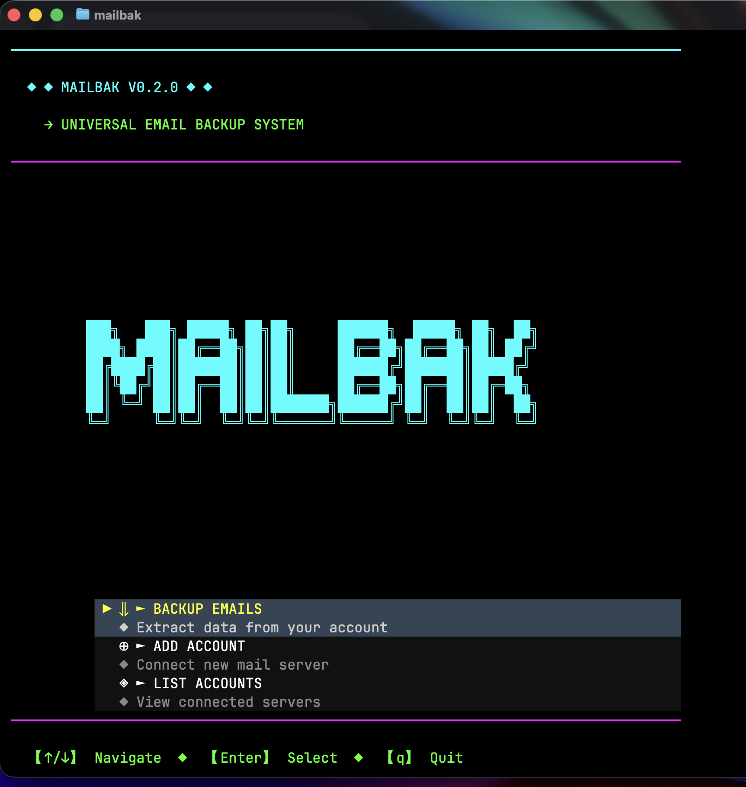
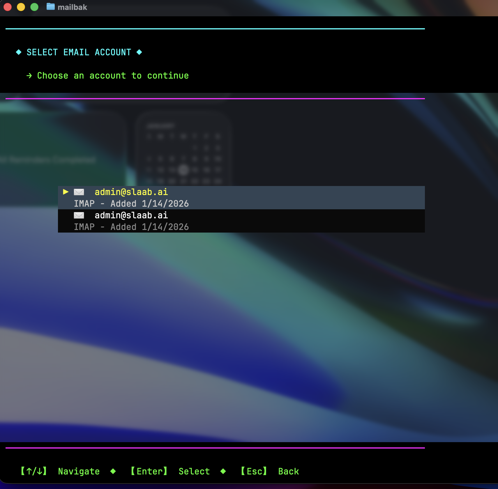

# 📧 mailbak

> Universal email backup and migration tool with an interactive cyberpunk TUI

[](https://www.npmjs.com/package/mailbak)
[](https://opensource.org/licenses/MIT)

Fast and secure email backup tool supporting Gmail, JMAP (Fastmail), IMAP servers, and multiple export formats. Features both CLI and an interactive cyberpunk-themed TUI.

## 📸 Screenshots

<p align="center">
  
  <br>
  <em>Cyberpunk-themed TUI with neon colors</em>
</p>

<p align="center">
  
  <br>
  <em>Real-time backup progress tracking</em>
</p>

## ✨ Features

- 🎨 **Interactive TUI** - Cyberpunk-themed terminal interface with neon colors
- 📦 **Multiple Formats** - Export to MBOX, EML, and JSON
- 🔐 **Secure** - OAuth2 for Gmail, encrypted credential storage
- 🚀 **Fast** - Built with Bun for maximum performance
- 🔗 **JMAP Support** - Modern email protocol for Fastmail and compatible servers
- 📁 **Flexible** - Backup to local storage, home directory, or custom paths
- 🔄 **Migration** - Transfer emails between different accounts
- 💾 **Zero Dependencies** - Uses Bun's built-in features

## 🚀 Installation

```bash
# Using npm
npm install -g mailbak

# Using bun (recommended)
bun install -g mailbak

# From source
git clone https://github.com/codingstark-dev/backupmail
cd backupmail
bun install
```

## 📖 Usage

### Interactive TUI (Default)

Simply run `mailbak` to launch the cyberpunk TUI:

```bash
mailbak
```

Navigate with arrow keys and enjoy the cyberpunk interface!

### CLI Mode

Use with arguments to enter CLI mode:

```bash
# Show help
mailbak --help

# Show version
mailbak --version

# Add account
mailbak auth add

# List accounts
mailbak auth list

# Backup emails
mailbak backup <accountId> --format mbox --output ./backups

# Migrate between accounts
mailbak migrate <fromAccountId> <toAccountId>
```

## 🎮 TUI Features

- ASCII art logo with neon glow effects
- Real-time backup progress tracking
- Multiple export location options (current dir, home dir, custom path)
- Format selection wizard (MBOX, EML, JSON)
- Cyberpunk color scheme (neon cyan, magenta, green)

### Navigation
- `↑/↓` - Navigate menus
- `Enter` - Select option
- `Esc` - Go back
- `q` - Quit

## 📦 Supported Formats

### MBOX
Standard Unix mailbox format
- Compatible with: Thunderbird, Apple Mail, Gmail import

### EML
Individual email files
- Compatible with: Outlook, Windows Mail

### JSON
Structured metadata
- Use case: Data analysis, custom processing

## 🔧 Configuration

Config stored in `~/.mailbak/`:
```
~/.mailbak/
├── config.json
└── credentials/
```

## 🌟 Supported Providers

- ✅ Gmail (OAuth2)
- ✅ JMAP (Fastmail and any JMAP-compliant server)
- ✅ Generic IMAP
- ✅ SpaceMail
- ✅ Any IMAP-compatible service

### JMAP Support

[JMAP](https://jmap.io/) is the modern, open standard for email access (RFC 8620, RFC 8621). It's faster and more efficient than IMAP, especially for mobile and web applications.

**Supported JMAP providers:**
- Fastmail (pre-configured)
- Any JMAP-compliant server (custom URL)

```bash
# Add a JMAP account via CLI
mailbak auth add
# Select "JMAP (Fastmail, etc.)"

# Or use the TUI
mailbak
# Navigate to "Add Account" → "JMAP (Fastmail, etc.)"
```

## 💻 Development

```bash
# Install dependencies
bun install

# Run in TUI mode (default)
bun run dev

# Run with CLI arguments
bun run dev -- --help
bun run dev -- auth list

# Build
bun run build

# Test
bun test
```

## 🤝 Contributing

Contributions welcome! Please:
1. Fork the repository
2. Create feature branch
3. Add tests
4. Submit pull request

## 📄 License

MIT © [codingstark-dev](https://github.com/codingstark-dev)

## 🔗 Links

- [GitHub](https://github.com/codingstark-dev/backupmail)
- [npm](https://www.npmjs.com/package/mailbak)
- [Issues](https://github.com/codingstark-dev/backupmail/issues)

---

Made with ❤️ using [Bun](https://bun.sh/) and [OpenTUI](https://github.com/anomalyco/opentui)
